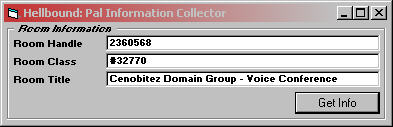



## Hellbound: Paltalk Room Info Collector

### Description

Please Vote and Comment On This Code, The more votes n Comments i get the more i will post :) 

 

I put this cleaner version of the code to find the paltalk room window and to get some info about it, when i started programming for paltalk this was the hardest part of it, coz the title changes every time!, This code will find Red Room (non voice) and Blue Rooms (Voice) and works weather admin or not! Hope this is helpfull :) Comments Please
 
### More Info
 

             |
---                |---
**Submitted On**   |2003-09-22 11:13:02
**By**             |[Steve \(Cenobitez\)](https://github.com/Planet-Source-Code/PSCIndex/blob/master/ByAuthor/steve-cenobitez.md)
**Level**          |Intermediate
**User Rating**    |4.7 (28 globes from 6 users)
**Compatibility**  |VB 5\.0, VB 6\.0
**Category**       |[Complete Applications](https://github.com/Planet-Source-Code/PSCIndex/blob/master/ByCategory/complete-applications__1-27.md)
**World**          |[Visual Basic](https://github.com/Planet-Source-Code/PSCIndex/blob/master/ByWorld/visual-basic.md)
**Archive File**   |[Hellbound\_1648659222003\.zip](https://github.com/Planet-Source-Code/steve-cenobitez-hellbound-paltalk-room-info-collector__1-48698/archive/master.zip)

